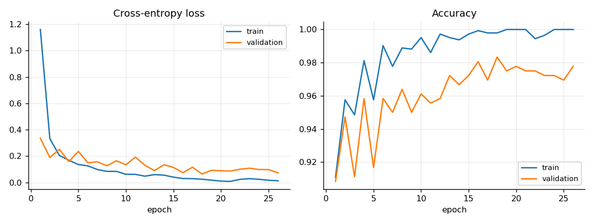
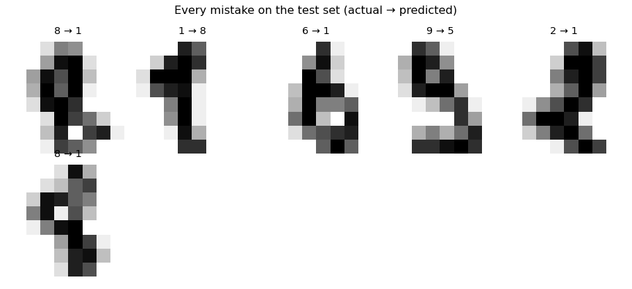
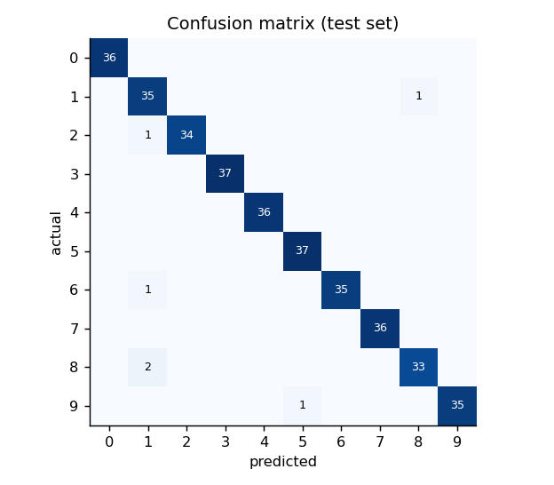

# Neural Network From Scratch

[](https://github.com/umer-78/neural-network-from-scratch/actions/workflows/ci.yml)


A feed-forward neural network built from first principles in NumPy: forward pass,
**hand-derived backpropagation**, SGD with momentum, Adam, dropout, early
stopping — and a numerical gradient check that proves the maths is right.

No PyTorch, no TensorFlow, no autograd. About 600 lines you can read in a sitting.



## Results on the digits dataset

8×8 handwritten digits (1,797 samples, scikit-learn's copy of the UCI set),
architecture 64-128-64-10, dropout 0.1, SGD with momentum:

```text
epoch  26  loss 0.0129  acc 1.0000  val_loss 0.0731  val_acc 0.9778
stopping early: no improvement for 8 epochs

trained in 0.5s   train accuracy 0.9979   test accuracy 0.9833
6 wrong out of 360 test digits
```

Every mistake it makes on the test set:



Most are genuinely ambiguous 8×8 digits. The confusion matrix:



### SGD against Adam, same seed and data

```text
optimiser   epochs  train acc  test acc  seconds
sgd             20      1.000     0.978      0.3
adam            20      1.000     0.983      0.5
```

## Proof the backprop is correct

Each analytic gradient is compared with a central finite difference
`(L(w+ε) − L(w−ε)) / 2ε`. Agreement to about 1e-8 means the chain rule was
applied correctly.

```bash
$ nnscratch gradcheck
4-6-3        worst relative error 1.59e-08
3-8-8-2      worst relative error 9.30e-08
5-4-4        worst relative error 7.44e-07
backprop matches numerical gradients
```

This runs in CI, so a wrong derivative can never be merged quietly.

## What is implemented

| Piece | File | Notes |
|---|---|---|
| Dense layer | `layers.py` | He and Xavier initialisation; gradients averaged over the batch |
| Activations | `layers.py` | ReLU, Sigmoid (clipped, no overflow), Tanh, Softmax (max-shifted) |
| Dropout | `layers.py` | Inverted dropout, so inference needs no rescaling |
| Losses | `losses.py` | MSE; cross-entropy whose gradient folds the softmax Jacobian into `p − y` |
| Optimisers | `optimisers.py` | SGD with momentum and weight decay; Adam with bias correction |
| Training loop | `network.py` | Mini-batches, shuffling, validation, early stopping with best-weight restore |
| Gradient check | `gradcheck.py` | Central differences over every parameter |
| Datasets | `datasets.py` | digits and two-moons, both bundled with scikit-learn |

## Use it

```bash
git clone https://github.com/umer-78/neural-network-from-scratch.git
cd neural-network-from-scratch
python -m venv .venv && source .venv/bin/activate
pip install -e ".[dev]"

nnscratch gradcheck                                   # verify backprop
nnscratch train --charts reports --save models/digits  # train on digits
nnscratch train --hidden 256,128 --optimiser adam --lr 0.003 --epochs 60
nnscratch compare                                     # SGD against Adam
nnscratch moons                                       # the classic non-linear toy problem
```

As a library:

```python
from nnscratch import Adam
from nnscratch.network import mlp
from nnscratch.datasets import digits

x_train, x_test, y_train, y_test, _ = digits()
net = mlp([64, 128, 10], dropout=0.1, optimiser=Adam(0.005))
net.fit(x_train, y_train, epochs=30, validation=(x_test, y_test), early_stopping=5)
print(net.score(x_test, y_test))
net.save("models/digits")
```

## Things worth knowing

- **Cross-entropy after softmax**: computing `dL/dz = p − y` in one step avoids
  building the full softmax Jacobian and is numerically stable.
- **Batch-averaged gradients**: the learning rate then means the same thing at
  batch size 8 and 128.
- **Early stopping restores the best weights**, not the last ones, so the reported
  score matches the model you keep.
- **Dropout is off at inference** — one of the easiest bugs to ship, and the tests check it.

## Tests

```bash
ruff check .
python -m pytest -q      # 20 tests
```

They cover layer shapes and derivatives, softmax stability at 1000, inverted
dropout, cross-entropy against hand-computed values, the gradient check on three
architectures, learning XOR (impossible without a hidden layer), early stopping,
and saving and reloading weights.

## Not in scope

Convolutions, recurrent layers, batch norm and GPU support. For real work use
PyTorch — the point here is to show what it does underneath.

## License

[MIT](LICENSE)
